# How to Build a Computer?

<a href='code-note.html'>中文</a>

This is a graph note for the book "*Code: The Hidden Language of Computer Hardware and Software*".

[TOC]

## How to Build a Computer

## Ideas before Computer

## Coding

## Numeric Coding

```mermaid
graph LR
subgraph Math
N(Natural number)
NG(Negative integer)
Z(Integer)
N-.->Z
NG-.->Z

F(Fraction)
R(Rational number)
F-.->R
Z-.->R

IR(Irational number)
RE(Real number)
R-.->RE
IR-.->RE

IM(Imaginary number)
CPL(Complex number)
RE-.->CPL
IM-.->CPL
end

subgraph Notation
C(Continuous number)
D(Discrete number)
C-.->|Restricted by computer|D

sig(Sign bit)
Fix(Fixed-point number)
D-.->Fix
sig-.->Fix

int(Fixed-point integer)
frac(Fixed-point fraction)
Fix-.->int
Fix-.->frac

sci(Scientific notation)
man(Mantissa)
exp(Exponent)
sci-.->man
sci-.->exp

Flo(Floating number)
D-.->Flo
sig-.->Flo
man-.->Flo
exp-.->Flo

f32(32-bit float)
d64(64-bit double)
Flo-.->f32
Flo-.->d64
end

classDef node fill:gray,stroke-width:0px,color:white

style Notation fill:white,stroke:black
style Math fill:white,stroke:black
```

## Image Coding

## Audio Coding

