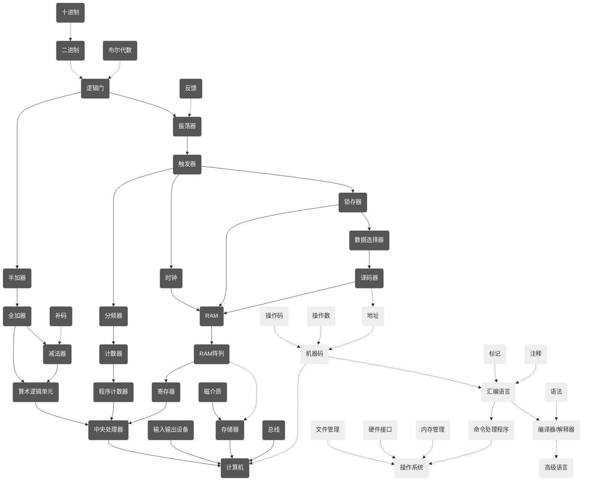
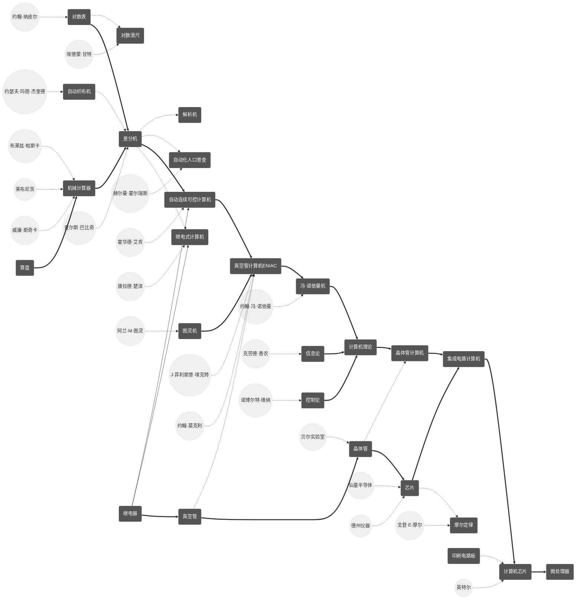
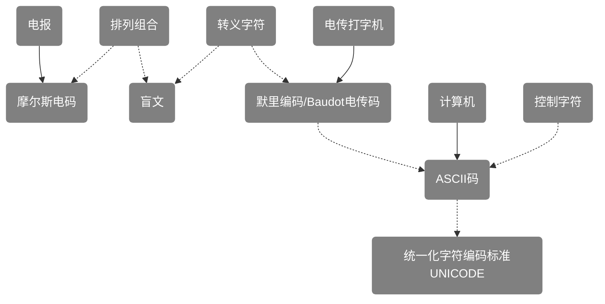
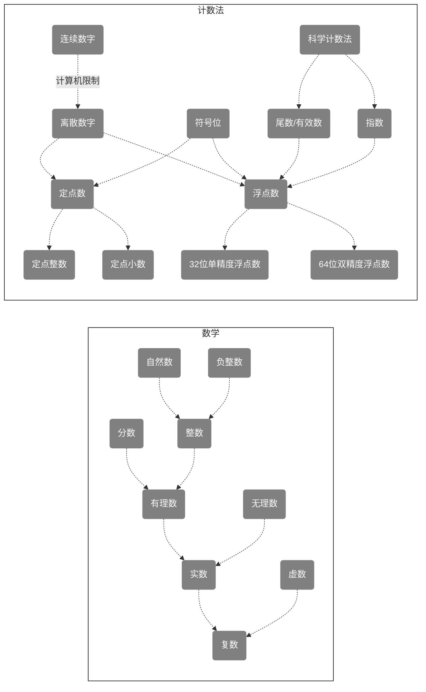
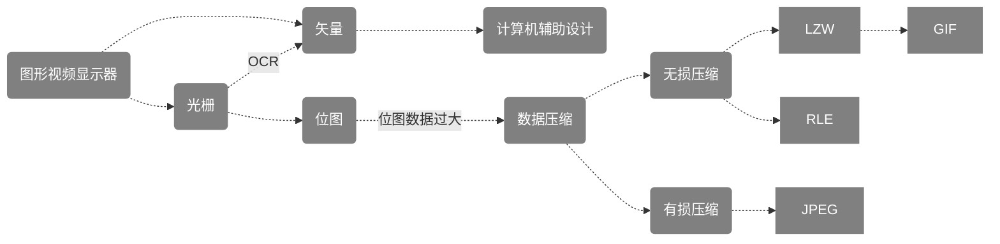
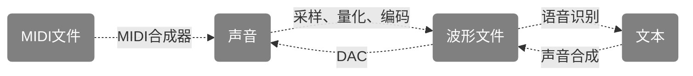

# 《编码》杂记

[TOC]

## 构建一台计算机

```mermaid
graph TD
F(二进制):::common
F1(十进制):::common
H(布尔代数):::common
I(逻辑门):::common
F-.->I
H-.->I
F1-.->F

J(半加器):::common
L(全加器):::common
N(减法器):::common
O(补码):::common
ALU(算术逻辑单元):::common
L-->ALU
N-->ALU
I-->J
J-->L
L-->N
O-.->N

P(振荡器):::common
Q(反馈):::common
R(时钟):::common
S(触发器):::common
I-->P
Q-.->P
P-->S
S-->R

T(分频器):::common
T1(计数器):::common
PC(程序计数器):::common
T1-->PC
S-->T
T-->T1

U(数据选择器):::common
U1(译码器):::common
S1(锁存器):::common
S2(RAM):::common
S3(RAM阵列):::common
S-->S1
R-->S2
S1-->U
U-->U1
S1-->S2
U1-->S2
S2-->S3

CPU(中央处理器):::common
ALU-->CPU
PC-->CPU

RG(寄存器):::common
S3-->RG
RG-->CPU

ST(存储器):::common
MG(磁介质):::common
IO(输入输出设备):::common
BW(总线):::common
CP(计算机):::common
MG-->ST
CPU-->CP
IO-->CP
ST-->CP
BW-->CP
S3-.->ST

ADR(地址):::soft
OP(操作码):::soft
ON(操作数):::soft
MC(机器码):::soft
MC-.->CP
OP-.->MC
ON-.->MC
ADR-.->MC
U1-.->ADR

ASL(汇编语言):::soft
LB(标记):::soft
CM(注释):::soft
MC-.->ASL
LB-.->ASL
CM-.->ASL

CMD(命令处理程序):::soft
ASL-.->CMD
FOP(文件管理):::soft
API(硬件接口):::soft
PROC(内存管理):::soft
OS(操作系统):::soft
FOP-.->OS
API-.->OS
PROC-.->OS
CMD-.->OS

syntax(语法):::soft
compiler("编译器/解释器"):::soft
HPL(高级语言):::soft
ASL-.->compiler
compiler-.->HPL
syntax-.->compiler

classDef common fill:#555555,color:white,stroke-width:0px
classDef soft fill:#0101,stroke-width:0px
```

## 计算机思想源流

```mermaid
graph LR
SP(算盘):::common
napier(("约翰·纳皮尔")):::people
DSB(对数表):::common
gunter(("埃德蒙·甘特")):::people
DSHC(对数滑尺):::common
napier-.->DSB
DSB-.->DSHC
gunter-.->DSHC

schickard(("威廉·斯奇卡")):::people
JXJSQ(机械计算器):::common
pascal(("布莱兹·帕斯卡")):::people
leibniz(("莱布尼茨")):::people
pascal-.->JXJSQ
leibniz-.->JXJSQ
schickard-.->JXJSQ
SP==>JXJSQ

jacquard(("约瑟夫·玛丽·杰奎德")):::people
ZDZBJ("自动织布机"):::common
jacquard-.->ZDZBJ

babbage(("查尔斯·巴比奇")):::people
CFJ("差分机"):::common
JXJ("解析机"):::common
babbage-.->CFJ
DSB==>CFJ
ZDZBJ-.->CFJ
JXJSQ==>CFJ
CFJ-.->JXJ

hollerith(("赫尔曼·霍尔瑞斯")):::people
RKPC("自动化人口普查"):::common
hollerith-.->RKPC
CFJ-.->RKPC

aiken(("霍华德·艾肯")):::people
ASCC(自动连续可控计算机):::common
aiken-.->ASCC
CFJ==>ASCC

zuse(("康拉德·楚泽")):::people
JDSCP("继电式计算机"):::common
zuse-.->JDSCP
CFJ-.->JDSCP

turing(("阿兰·M·图灵")):::people
TLJ(图灵机):::common
turing-.->TLJ

eckert(("J·菲利斯普·埃克特")):::people
mauchly(("约翰·莫克利")):::people
ENIAC(真空管计算机ENIAC):::common
eckert-.->ENIAC
mauchly-.->ENIAC
ZKG-.->ENIAC
ASCC==>ENIAC
TLJ==>ENIAC

neumann(("约翰·冯·诺依曼")):::people
VNJ("冯·诺依曼机"):::common
neumann-.->VNJ
ENIAC==>VNJ

shannon(("克劳德·香农")):::people
INF(信息论):::common
shannon-.->INF

wiener(("诺博尔特·维纳")):::people
CBYER(控制论):::common
wiener-.->CBYER

MCP(计算机理论):::common
INF==>MCP
CBYER==>MCP
VNJ==>MCP


bell(("贝尔实验室")):::people
JTG(晶体管):::common
bell-.->JTG
ZKG==>JTG

JTGCP(晶体管计算机):::common
MCP==>JTGCP
JTG-.->JTGCP

JCCP(集成电路计算机):::common
JTGCP==>JCCP
IC==>JCCP

moore(("戈登·E·摩尔")):::people
MR(摩尔定律):::common
moore-.->MR
IC-.->MR

PCB(印刷电路板):::common
SICP(计算机芯片):::common
intel((英特尔)):::people
intel-.->SICP
PCB-.->SICP
JCCP==>SICP

MCPP(微处理器):::common
SICP==>MCPP

JDQ("继电器"):::common
ZKG("真空管"):::common
JDQ-->ASCC
JDQ-->JDSCP
JDQ==>ZKG
xt((仙童半导体)):::people
ti((德州仪器)):::people
IC(芯片):::common
xt-.->IC
ti-.->IC
JTG==>IC

classDef common fill:#555555,color:white,stroke-width:0px
classDef people fill:#0101,stroke-width:0px
```

## 计算机编码

```mermaid
graph TD
B(排列组合)
C(盲文)
D(摩尔斯电码)
B-.->C
B-.->D

CG(转义字符)
MRY(默里编码/Baudot电传码)
CG-.->MRY
CG-.->C

T1(电报)
T2(电传打字机)
T1-->D
T2-->MRY

CP(计算机)
CTR(控制字符)
ASCII(ASCII码)
MRY-.->ASCII
CTR-.->ASCII
CP-->ASCII

UNICODE(统一化字符编码标准UNICODE)
ASCII-.->UNICODE

classDef node fill:gray,stroke-width:0px,color:white
```

## 数字

```mermaid
graph LR
subgraph 数学
N(自然数)
NG(负整数)
Z(整数)
N-.->Z
NG-.->Z

F(分数)
R(有理数)
F-.->R
Z-.->R

IR(无理数)
RE(实数)
R-.->RE
IR-.->RE

IM(虚数)
CPL(复数)
RE-.->CPL
IM-.->CPL
end
subgraph 计数法
C(连续数字)
D(离散数字)
C-.->|计算机限制|D

sig(符号位)
Fix(定点数)
D-.->Fix
sig-.->Fix

int(定点整数)
frac(定点小数)
Fix-.->int
Fix-.->frac

sci(科学计数法)
man(尾数/有效数)
exp(指数)
sci-.->man
sci-.->exp

Flo(浮点数)
D-.->Flo
sig-.->Flo
man-.->Flo
exp-.->Flo

f32(32位单精度浮点数)
d64(64位双精度浮点数)
Flo-.->f32
Flo-.->d64
end

classDef node fill:gray,stroke-width:0px,color:white

style 计数法 fill:white,stroke:black
style 数学 fill:white,stroke:black
```

## 图像

```mermaid
graph LR
M(图形视频显示器)
BM(光栅)
VC(矢量)
M-.->BM
M-.->VC

CAD(计算机辅助设计)
VC-.->CAD

BMP(位图)
BM-.->BMP

DC(数据压缩)
BMP-.->|位图数据过大|DC

ll(无损压缩)
l(有损压缩)
DC-.->l
DC-.->ll

ll-.->LZW
ll-.->RLE
LZW-.->GIF

l-.->JPEG

BM-.->|OCR|VC

classDef node fill:gray,stroke-width:0px,color:white
```

## 声音

```mermaid
graph LR
S(声音)
W(波形文件)
T(文本)
S-.->|"采样、量化、编码"|W
W-.->|DAC|S
W-.->|语音识别|T
T-.->|声音合成|W

MIDI(MIDI文件)
MIDI-.->|MIDI合成器|S

classDef node fill:gray,stroke-width:0px,color:white
```

