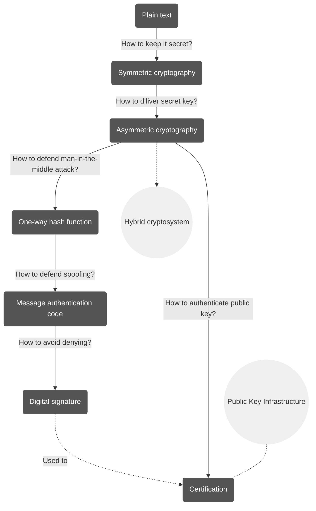

# Note for *Cryptography*

<a href='encrypto-note.html'>中文</a>

## ENCRYPTIONs DRIVEN BY DEMAND AND THREATS

```mermaid
graph TD
A(Plain text):::encrypto
B(Symmetric cryptography):::encrypto
C(Asymmetric cryptography):::encrypto
D(One-way hash function):::encrypto
E(Message authentication code):::encrypto
F(Digital signature):::encrypto
G(Certification):::encrypto

s1((Hybrid cryptosystem)):::sys
s2((Public Key Infrastructure)):::sys

A-->|How to keep it secret?|B
B-->|How to diliver secret key?|C
C-->|How to defend man-in-the-middle attack?|D
D-->|How to defend spoofing?|E
E-->|How to avoid denying?|F
F-.->|Used to|G

C-->|How to authenticate public key?|G

C-.->s1
s2-.-G

classDef encrypto fill:#555555,color:white,stroke-width:0px
classDef sys fill:#0101,stroke-width:0px
```

