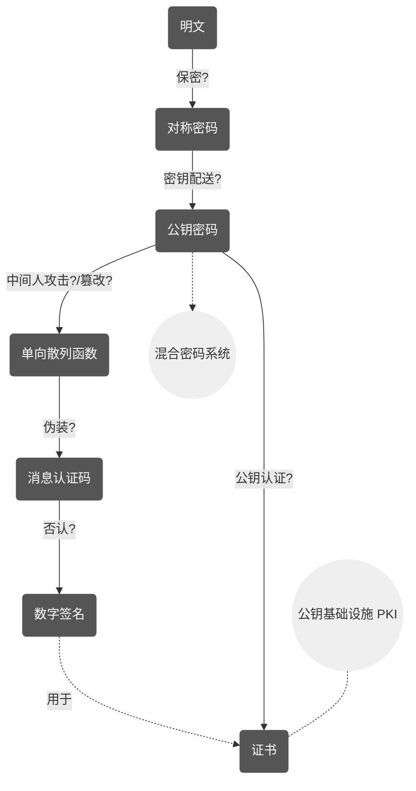

# 密码学杂记

<a href='encrypto-note-en.html'>ENGLISH</a>

## 密码变迁图

```mermaid
graph TD
A(明文):::encrypto
B(对称密码):::encrypto
C(公钥密码):::encrypto
D(单向散列函数):::encrypto
E(消息认证码):::encrypto
F(数字签名):::encrypto
G(证书):::encrypto

s1((混合密码系统)):::sys
s2((公钥基础设施 PKI)):::sys

A-->|保密?|B
B-->|密钥配送?|C
C-->|中间人攻击?/篡改?|D
D-->|伪装?|E
E-->|否认?|F
F-.->|用于|G

C-->|公钥认证?|G

C-.->s1
s2-.-G

classDef encrypto fill:#555555,color:white,stroke-width:0px
classDef sys fill:#0101,stroke-width:0px
```

