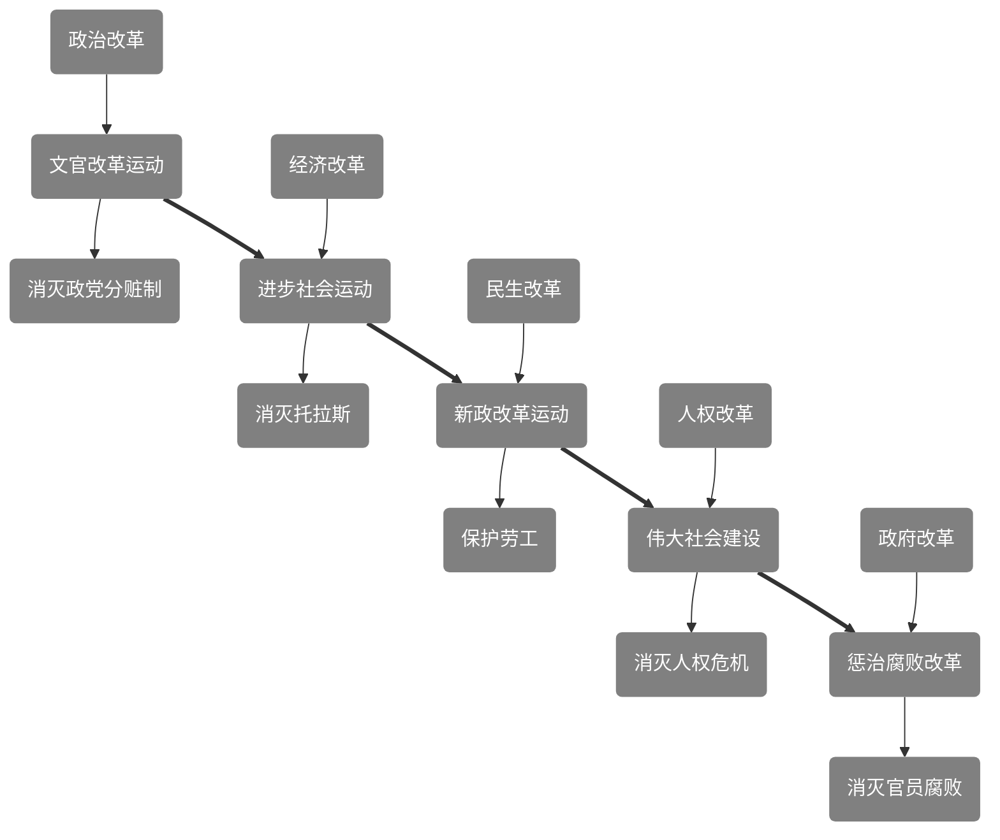

# 美国政经通史杂记

改革浪潮

```mermaid
graph TD
A(文官改革运动)
B(进步社会运动)
C(新政改革运动)
D(伟大社会建设)
E(惩治腐败改革)

a(消灭政党分赃制)
b(消灭托拉斯)
c(保护劳工)
d(消灭人权危机)
e(消灭官员腐败)

a1(政治改革)
b1(经济改革)
c1(民生改革)
d1(人权改革)
e1(政府改革)

a1-->A
b1-->B
c1-->C
d1-->D
e1-->E

A-->a
B-->b
C-->c
D-->d
E-->e

A==>B
B==>C
C==>D
D==>E

classDef node fill:gray,stroke-width:0px,color:white
```

