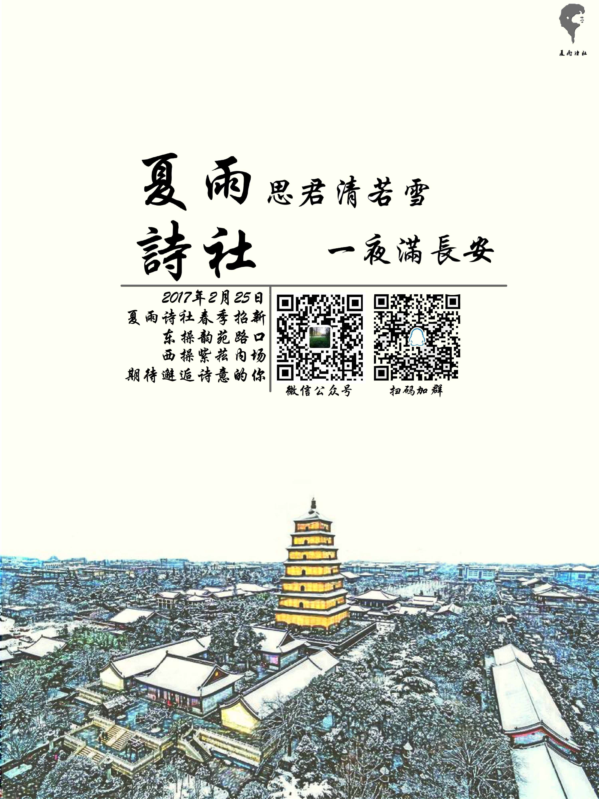
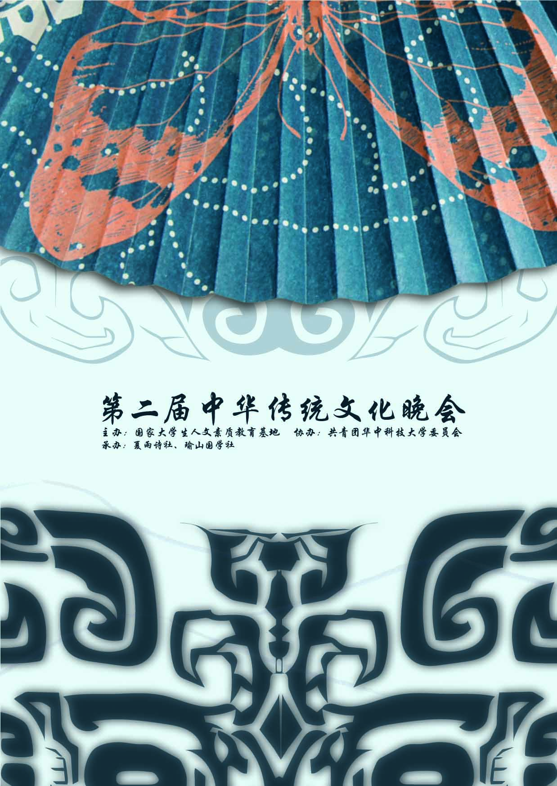
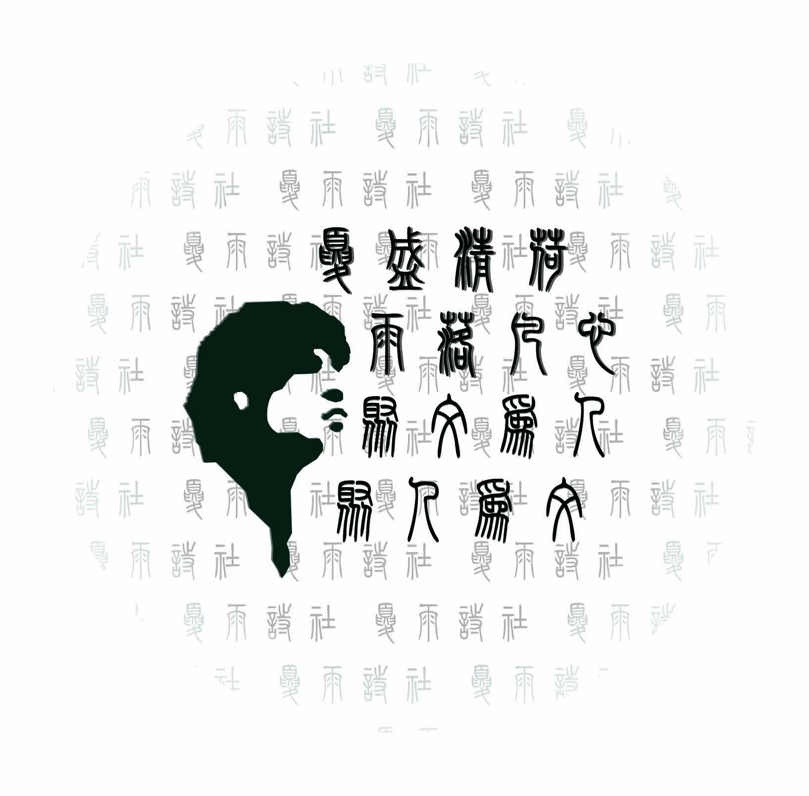
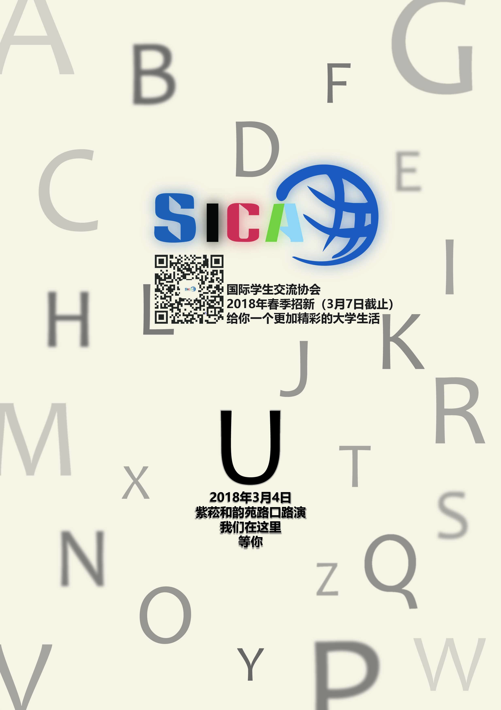
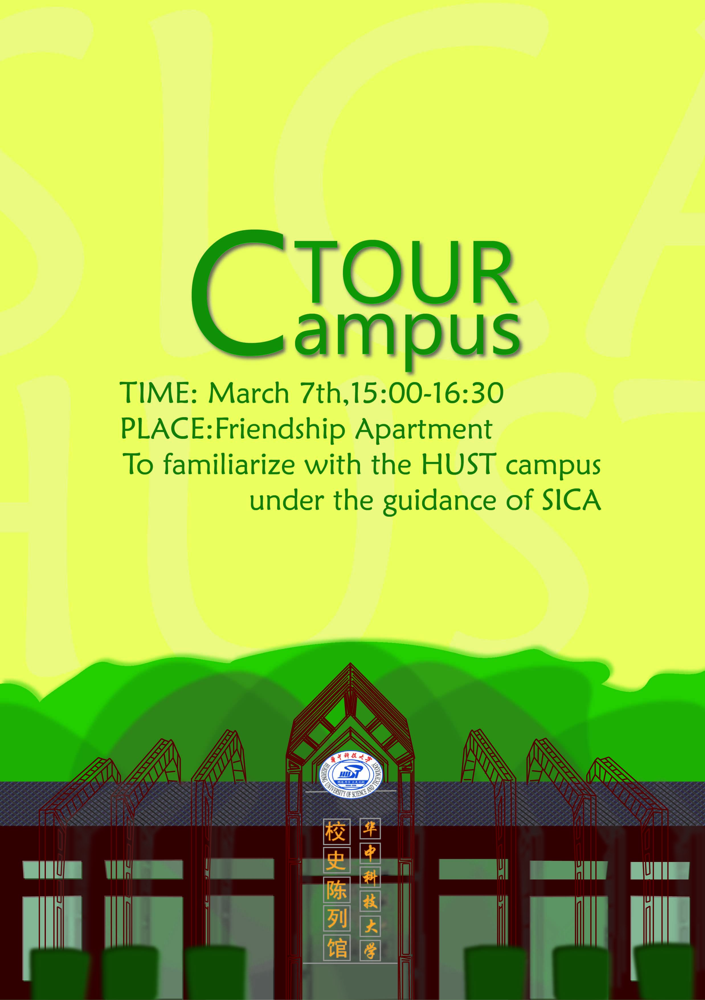
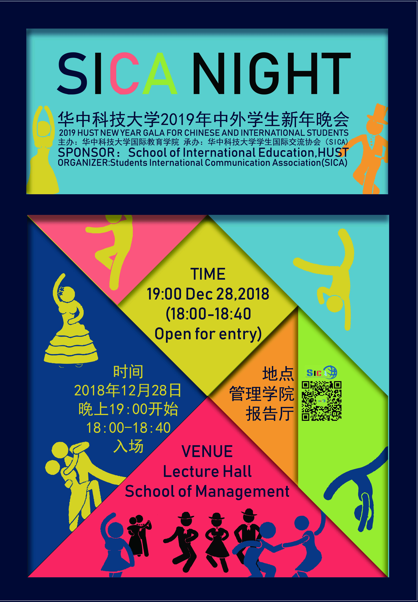
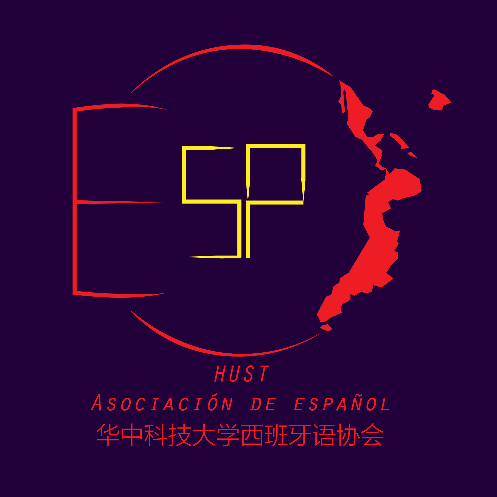

# graphic design

I have been a graphic designer in several student associations. Here is a small gallery of them. Note that I am not an expertise. 

### Xiayu Poetry Association

<table width=400 border="0">
    <tr>
        <td></td>
        <td></td>
        <td></td>
        <td></td>
        <td></td>
    </tr>
</table>

The up-left one was my very first poster, which is a little naive from my current perspective.  Xiayu Poerty Association is made up of a bunch of poetry fans. The first two posters were designed for recruitment. The third was for a competition. The fourth was for a booklet, in which there were pictures for a party. The fifth was for a shirt.

### Student International Communication Association (SICA)

<table width=400 border="0">
    <tr>
        <td></td>
        <td></td>
        <td></td>
        <td></td>
        <td></td>
    </tr>
</table>

SICA is a bridge between national and international students in my university. I volunteered as a Chinese teacher in the sophomore year and joined in as a designer. The first one was for a talkshow and obiviously it was about how would it be like in a poverty-free world. The second one was a recruitment for a gala called "SICA Night". The third was for the recruitment of association. The fourth was designed for a call of an activity called "Campus Tour", in which seniors would take the new students for a campus tour and get them familiarize with the facilities. The red house on it is the museum exhibiting the history of Huazhong University of Science and Technology. The fifth was for the gala again, but it was never used since some members thought it was too colorful. Whatever, I like my design.

### Misc

<table width=400 border="0">
    <tr>
        <td>
            </td>
    </tr>
</table>

These were extra. The first one was designed for a technical group's activity. It was an open day that all students were welcome to try VR (Virtual Reality) devices. The second was designed for the Association of Spanish as a logo. We, some other students interested in Spanish and me, tried to organize an association of Spanish in the sophomore year. It officially failed but unofficially succeeded, since we couldn't find a Spanish speaking teacher as our guidance, which was required by the authority for a new association to be registered.

---

<b><a href="../resume.html">BACK TO RESUME</a></b>

