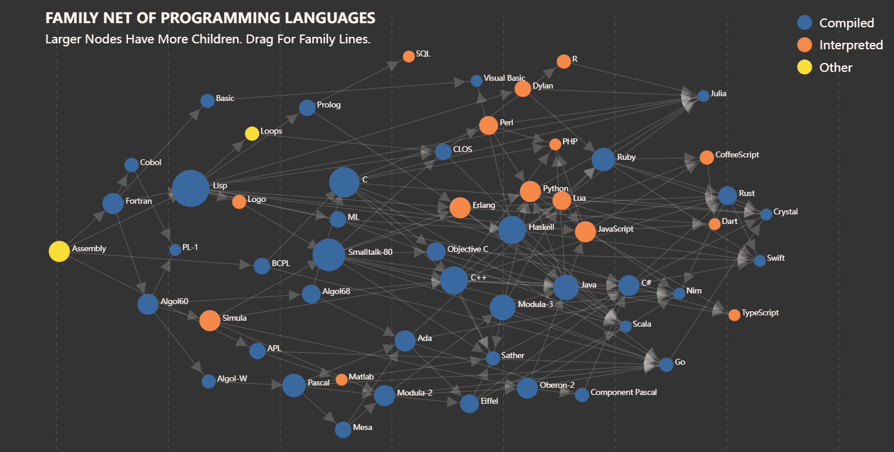
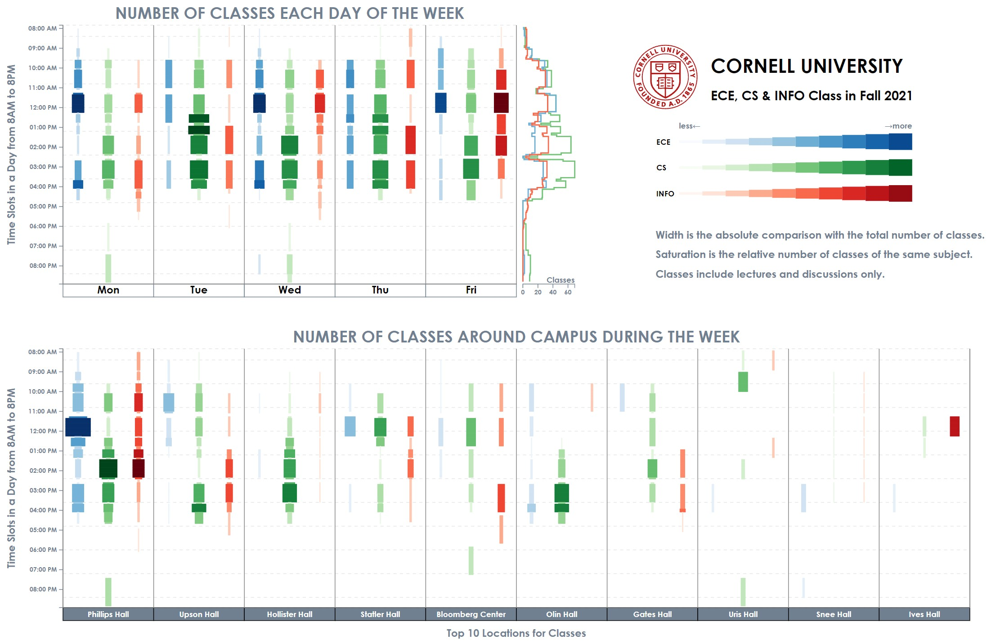

# Projects

Haoyang Li

[TOC]

## Major Projects

### The Generation and Detection of Deepfakes, Dec. 2019 - May 2020

Code: https://github.com/Greenere/faceswap

This is my graduate design for my bachelor's degree. The major focus is the generation of deepfakes, more specificly, face swapped videos. I adjust the existing method with some minor improvements for generation part. The detection of deepfakes appears as a survey in the final paper.

==**Scheme**==

It takes a lot of work for auxiliary modules to construct an end-to-end pipeline as shown below:

</img>

Each video is first digested into frames, ceating two small datasets of faces after **Face Detection** and **Face Alignment**. These two datasets are then used to train **Intracoder** and **Color Correction** modules. At inference, these two modules together swap the original faces but maintain the original color, creating a new datasets of swapped faces. These swapped faces are then fused with corresponding original face and de-aligned to the original posture. Merging the original background with de-aligned swapped face creates a frame of final deepfake. Assemble these frames, there comes the final deepfake.

I adopt a public MTCNN for **Face Detection**, warp affine for **Face Alignment**  and **Posture Reduction**, Poisson image blending for **Image Fusion**. The major works are **Intracoder** and **Color Correction**.

==**Intracoder**==

The structure of **Intracoder** is shown below:

</img>

 

Just like the initial scheme of deepfakes, two auto-encoders share the same encoder that force the encoder to map two types of faces into the same latent space. The decoders are owned distinctly by each type of face. After sufficient training, we can then map the origin face into the domain of target face. The synthesized face has the posture of original face and the identity of target face. The posture information is more abstract and the identity information is more concrete. To maintain the more abstract posture, I use a more deeper encoder compared with decoder. 

==**Color Correction**==

Most of other implementations use a classical method to correct the color:

*Reinhard E, Adhikhmin M, Gooch B, et al. Color transfer between images[J]. IEEE Computer graphics and applications, 2001.*

In my case, I also want the color correction module to super-resolute the swapped face and correct artifacts brought by **Intracoder**. So I use another pair of auto-encoders as shown below:

</img>

Color information is rather shallow, so the decoder is actually only one layer deep.

**==Results==**

The performance of swapping faces is satisfactory:

</img>

But the deepfake video generated is not as good as the public implementations:

 <table>
<tr>
<td align="right"></td>
<td align="center"></td>
<td align="left"></td>
</tr>
<tr>
<td width=25% align="right">Gesture donator</td>
<td width=35% align="center">Identity donator</td>
<td width=25% align="left">Deepfake generated</td>
</tr>
</table>

This is expected as I use no temporal information. It is easy to see inter-frame artifacts from the generated deepfake.

### "WEIBE" weibo emotion analysis system, Nov. 2019 - Dec. 2019

Code: https://github.com/Greenere/weibe

This is a course project for the course, Capstone Project in Big Data Processing System. The core idea of this project is to fetch the trending topics of weibo (the Chinese version of Twitter) and analyze corresponding posts for the emotion tendencies concealed in each tweet.

I am responsible for the system rather than the algorithm behind the emotion analysis. The scheme I designed for this system is shown as below.

</img>

The dark parts are the off-shelf programs utilized by this system and the light parts are our own modules. I write the **Web Crawler** in Python with the help of *Selenium* , driving a chrome browser to fetch the web pages of *Weibo*, collect trending topics and posts and put them into a *Mongodb* database. The **Server** is also composed with Python using *Flask* and *Gevent*. A very basic static pages server is capable enough for our purpose. The **Frontend** is coded with the basic web languages, HTML for structure, CSS for style and JavaScript for actions. 

    
    

Due to the limited computational resources, we limit the number of posts fetched for each trending topic. It is not a really "big" data processing system, but the results are actually very informative. Unexpectedly, we happened to catch the trending topics invoked by an earthquake near Wuhan and the initial of COVID-19 outbreak. 

More details can be found in the github repository.

### "WELLMAIL" e-mail client, Nov. 2018 - Dec. 2018

Code: https://github.com/Greenere/wellmail

This is the very first project I ever participated that could be referred as a project. For the course, Software Project, an e-mail client is required to be designed and  implemented. 

We were splitted into groups of three, and we had literally zero experience about how to begin. Most of the other groups chose Java to programmed it, while we chose Python after a few consideration. Python is light, new and all three members wanted to proceed into relevant areas that requires Python's help.

It took one week for us to familiarize with Python. I first divided the whole project into three parts: network module, management module and graphic user interface module. Each of us was then in charge of one of the modules. But later we discovered that most of our work would be related to graphic interface, which was quite different from those programs with consoles we coded before. 

Therefore, I redivided the project according to the lagical relationship of graphic user interfaces. The logical relationship is shown below. I was in charge of the Recieve Box Module and the Main Module. 

</img>

A user first logs in through the Log Module, and then the Main Module communicates with the email service, fetching the information. Then it is the Recieve Box Module that appears in front of the user. Switches for the Writing Module, Setting Module, Contact Module, etc. are designed as buttons on the left of the Main Module. A search bar is placed above, with which the user can fetch the relevant e-mails with key words. 

We named this client as "WELLMAIL", "W" stands for Yun Wang, "L" and "L" stand for Xin Liu and Haoyang Li, and "E" stands for e-mail. This project was designated as one of the best among our peers, although there were many unsolved problems as a maiden work. Anyway, the most important skill I got from this experience was the use of Python and the basic ability to develop a software with graphic user interface.

## Minor Projects

### Programming Languages - Interactive Visualization, Dec. 2021

This is a data visualization course project realized with D3.js, check the visualization outcome in web page <a href="../visualizations/programming_languages/programming_languages.html">here</a>.

It is a course project in collaboration with Yuhao Lu, Yue Wang and Yue Zhao.

The project aims to display some interesting facts about programming languages in terms of their histories and popularities.

### Online Kitchen - Interactive Visualization, Nov. 2021

This is a data visualization course project realized with D3.js, check the visualization outcome in web page <a href="../visualizations/online_kitchen/online_kitchen.html">here</a>.

It is a course project in collaboration with Yuhao Lu, Yue Wang and Yue Zhao.

 

### Cornell Fall 2021 Class of ECE, CS & INFO Visualization & Analysis,  Oct. 2021

This is a data visualization course project realized with D3.js, check the visualization outcome in web page <a href="../visualizations/cornell_class/cornell_class_ece_cs_info_fall2021.html">here</a>.

It is a course project in collaboration with Han Xia, Yingxin Lin and  Yuhao Lu. 

</img>

### 3-D displayer (with 2-D LED array), May 2019 - Jun. 2019

This title is weird somehow. Well, it was a hardware project. We were required to craft a 3-D dsiplayer using a 2-D LED array, based on the persistence of vision. In plain text, we would rotate a plate planted with LEDs to create a hovering hologram of object that looked like a three dimensional one.  I was a part of a group of three, and majorly in responsible for the algorithm and software.

This problem seemed to be easy at first. We thought that if we could control the LEDs and motor simultaneously and synchronize them, we would be able to display any objects that were dismantled into arrays, prestored in the memory. But, there were nothing but troubles. First, we couldn't control the LEDs and motor synchronically, because they need to be powered separately and our resources were limited that we had no wireless communication module. Second, the memory was very small that it was impossible to store a series of arrays for an object. We had to generate it on the fly. Third, the 2-D LED array itself worked based on the persistence of vision, therefore the frequency of the rotation was limited in case that the 2-D array became separate dots.

Given those limitations, I devised a mechanism that moved most of the hard work to the software, where the memory was abundant, as shown above. To implement it, I developped a simulator with a structure of frontend and backend, with Python and JavaScript ( of course there was HTML).  The designed object and displayed object are shown below.

    <table border="0">
    <tr>
        <td align="right"></td><td align="left"></td>
    </tr>
    <tr>
        <td align="right"></td><td align="left"></td>
    </tr>
</table>

At the end, it was able to display cup, stair and cube, which was a three-dimensional element. Theoretically, with a more stable and more powerful device, it should be able to display anything. 

This was an interesting project. 

### Louvre Evacuation Strategy (ICM 2019), Jan. 2019

In Janurary. 2019, I led a group of three competed in the Interdisciplinary Contest in Modeling (ICM). We chose the problem designated as "D" that required us to build a model for the Louvre Museum and design an evacuation  strategy for it.  It took us one day to discuss and decide an appropriate model and finally I proposed a cellular automata model for the Louvre. You may think that we represented each person to be evacuated as a cell, but actually we chose several representative exhibition halls to be the cells in our model.

This model of Louvre is presented above. For each cell, there was a state that represented the number of people stuck inside when the evacuation began. The neighbors were linked according to the structure of the building. For each iteration, the people in each cell would be evacuated to the neighbors following the strategy.  The baseline strategy we considered was "random wandering", which meant that no instructions were given and people just walked randomly. The evacuation process of the five levels of the Louvre is presented below on the left. Our solution was called "dynamic plan "

</img>
</img>

It is very clear that under our simulation, our strategy reduces the overall evacuation time from 3000s to 600s. This so called "dynamic plan" was very simple. The core idea of it was to make sure that no congestion occur during the whole process, i.e. people would be welcomed by relatively empty exhibition halls and rejected by nearly filled ones. Our simulation results showed that no matter what the original strategy was, all people would be evacuated quickly with a dynamic control of congestion.

This model was implemented by MATLAB. We drafted the paper in a rash, and I think an "Honorable Mention" is appropriate and satisfactory.

---

BACK TO **[RESUME](../resume.html)** OR **[HOME](../index.html)**

<a class="md-toc-inner" href="#projects" style="text-decoration:none;" title="Back to the top">
🔝
</a>

