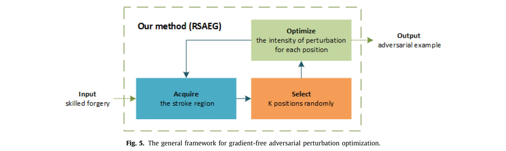
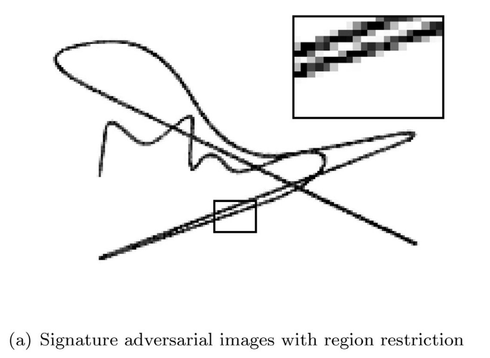
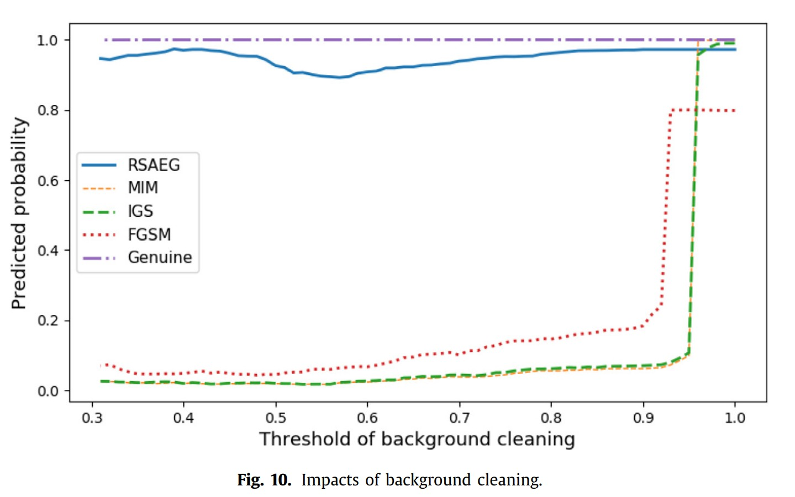

# Research

## Noise Modulation for Interpretable Input-gradients - Feb 2021

*Haoyang Li, Xinggang Wang. Noise Modulation: Let Your Model Interpret Itself.  arXiv preprint , [arXiv:2103.10603](https://arxiv.org/abs/2103.10603)*

Waiting for acceptance...

## Black-box Attack against Signature Verification - July 2019

*Haoyang Li, Heng Li, Hansong Zhang, Wei Yuan, [Black-box attack against handwritten signature verification with region-restricted adversarial perturbations](http://www.sciencedirect.com/science/article/pii/S0031320320304921), Pattern Recognition, Volume 111, 2021,107689, ISSN 0031-3203*

This research was started in July 2019. I met Prof. Wei Yuan at the course, Security of Network and Information. The course essay was about adversarial example, and I was intrigued by this topic. Later I joined in Prof. Wei Yuan's lab and extended the idea in the course essay into a journal paper.

We chose signature as the target domain because Hansong Zhang was working on the verification of signatures. It was handy to attack. ==The major challenge besides black-box was the imperceptibility of adversarial perturbations. Given the clean background of signature images, most existing perturbations were quite obvious.== I came up with the idea to restrict the perturbations onto the stroke region, solving these two problems at once.

</img>

The scheme of attacking algorithm, namely RSAEG, is displayed above. It can be viewed as a gradient-free version of $l_0$ Projected Gradient Descent (PGD) attack. ==The **Acquire** module and **Select** module together estimate the gradient using a masked random noise. This approximated gradient is further used to guide black-box optimization. In our experiment, a binary search would perform quite well.==

</img></img>

The left are an example of our adversarial examples generated for signature. With all perturbations restricted to the stroke region, it is almost impossible to figure if this example are perturbed or not. Since only the stroke region, i.e. foreground of image, is perturbed, these adversarial perturbations can survive background cleaning as presented in the right. More analysis and results can be found in the original paper. 

BACK TO **[RESUME](../resume.html)** OR **[HOME](../index.html)**