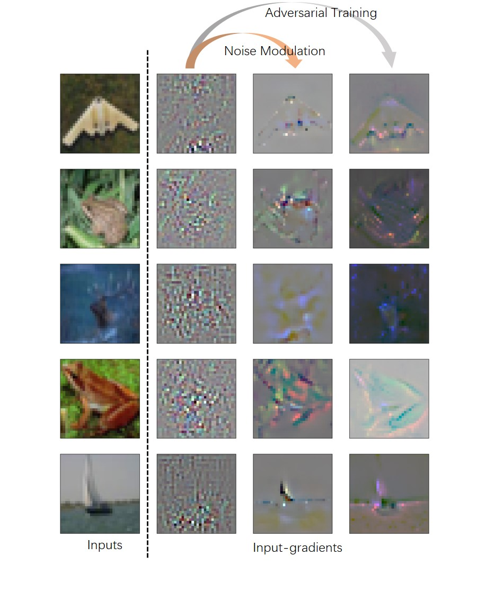

# Research

Haoyang Li

[TOC]

## Noise Modulation for Interpretable Input-gradients - Feb 2021

*Haoyang Li, Xinggang Wang. Noise Modulation: Let Your Model Interpret Itself.  arXiv preprint , [arXiv:2103.10603](https://arxiv.org/abs/2103.10603)*

It is not a unpublished work and it is unlikely to get published someday. But I still think it is an interesting paper.

</img>

I was studying how to defend a deep neural network model from [adversarial attacks](https://openai.com/blog/adversarial-example-research/), and the state-of-the-art methods are all based on [adversarial training](https://arxiv.org/abs/1706.06083). So I studied the models acquired through adversarial training. Basically there are three major differences from standard models:

1. It is more robust to adversarial attacks, despite still breachable by more advanced attacking strategies.
2. It becomes less confident about its predictions, while a standard model tends to present a result with high confidence score (near 100%).
3. It has a clean and interpretable input-gradients compared to the noisy and mistery input-gradients of standard models.

The literature tends to attribute the first one to the second and third features, and a bunch of works are devoted to finding an alternative to adversarial training that poses the second or the third feature because adversarial training is  expensive in terms of computations.

The third feature is also used to supplement that models acquired through adversarial training have a better interpretability. ==And this work of mine basically proposes a cheap alternative to recover the third feature, i.e. the clean and interpetable input-gradients==.

</img>

As shown above, this method, namely *noise modulation* is simple and easy to implement. It adds a preprocessor to the training pipeline such that each image is multiplied with a noise of the same size twice before it gets fed to the model. ==The intuition is that since the informative components are now hiding in a bunch of noisy pixels, the model is forced to learn to only use the critical components thus cleaning the input-gradients, making them interpretable to human==.

</img>

==However, as shown above, this increasement of interpretabilities brings a drop of accuracies that we could barely explain==. This is also the major concern of reviewers, which we could not justify. I think that it shall not get published officially until this problem is well addressed.

## Black-box Attack against Signature Verification - July 2019

Code: https://github.com/Greenere/rap_attack

*Haoyang Li, Heng Li, Hansong Zhang, Wei Yuan, [Black-box attack against handwritten signature verification with region-restricted adversarial perturbations](http://www.sciencedirect.com/science/article/pii/S0031320320304921), Pattern Recognition, Volume 111, 2021,107689, ISSN 0031-3203*

This research was started in July 2019. I met Prof. Wei Yuan at the course, Security of Network and Information. The course essay was about adversarial example, and I was intrigued by this topic. Later I joined in Prof. Wei Yuan's lab and extended the idea in the course essay into a journal paper.

We chose signature as the target domain because Hansong Zhang was working on the verification of signatures. It was handy to attack. ==The major challenge besides black-box was the imperceptibility of adversarial perturbations. Given the clean background of signature images, most existing perturbations were quite obvious.== I came up with the idea to restrict the perturbations onto the stroke region, solving these two problems at once.

</img>

The scheme of attacking algorithm, namely RSAEG, is displayed above. It can be viewed as a gradient-free version of $l_0$ Projected Gradient Descent (PGD) attack. ==The **Acquire** module and **Select** module together estimate the gradient using a masked random noise. This approximated gradient is further used to guide black-box optimization. In our experiment, a binary search would perform quite well.==

</img></img>

The left are an example of our adversarial examples generated for signature. With all perturbations restricted to the stroke region, it is almost impossible to figure if this example are perturbed or not. Since only the stroke region, i.e. foreground of image, is perturbed, these adversarial perturbations can survive background cleaning as presented in the right. More analysis and results can be found in the original paper. 

BACK TO **[RESUME](../resume.html)** OR **[HOME](../index.html)**

<a class="md-toc-inner" href="#research" style="text-decoration:none;" title="Back to the top">
🔝
</a>

