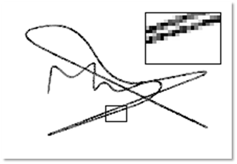

# Research&project

These are selected experiences of research and project, which I think are memorizable and valuable to me.

### "WELLMAIL" e-mail client, Nov. 2018-Dec. 2018

This was the very first project I ever participated that could be referred as a project. For the course, Software Project, an e-mail client was required to be designed and  implemented. We were splitted into groups of three, and we had literally zero experience about how to begin. Most of the other groups chose Java to programmed it, while we chose Python after a few consideration. Python is light, new and all three members wanted to proceed into relevant areas that requires Python's help.

It took one week for us to familiarize with Python. I first divided the whole project into three parts: network module, management module and graphic user interface module. Each of us was then in charge of one of the modules. But later we discovered that most of our work would be related to graphic interface, which was quite different from those programs with consoles we coded before.  Therefore, I redivided the project according to the lagical relationship of graphic user interfaces. I was in charge of the Recieve Box module and the Main Module. A user firstly logged in through the Log Module, and then the Main Module communicated with the service, fetching the information. Then it was the Recieve Box Module that appeared in front of the user. Switches for the Writing Module, Setting Module, Contact Module, etc. could be made through the buttons on the left of the Main Module. A search bar was placed above, and the user could fetch the relevant e-mails with key words. 

We named this client as "WELLMAIL", in the "WELL" of which, "W" stands for Yun Wang, "L" and "L" stand for Xin Liu and Haoyang Li, and "E" stands for e-mail. This project was designated as one of the best among our peers, although it was clear to us that as a maiden work, there were many parts that could be modified and improved in it. Anyway, the most important skill I got from this experience was that I learned Python and I learned how to develop a software with graphic user interface.

### Characters recognition for passport, Mar. 2019- Apr. 2019

The course, Digital Image Processing, was organized with multiple projects. A final test and a final coursework will contribute to most of the grade. We, four other classmates and me, chose the characters recognition for passport as our final coursework. We thought that characters recognition would be a useful and interesting process. This process was presumed to be a part of the verification system in customs, therefore, it required to be both fast and accurate.

An example of passport, published by the authority to show the appearance of passport, was given to us, and we are required to program to recognize the characters in it. It is an image scanned by special equipment. We solved this problem with a two-phase algorithm. For the first phase, the characters were located and cut off  and then for the second, each separate image of characters was classified and recognized. 

The first phase was achieved with statistical method as shown above. We tested a bunch of methods, and we found out that a simple statistical one would be sufficient and satisfactory under such a limited dataset. The second phase was done with template match, but we did investigated a series of methods, including SVM, CNN-based classifiers. It was the limited dataset that made us admit that the template match was the relatively superior method.

To this point, this problem was basically solved. We compared the recognition result with Tesseract OCR (It was unfit to compare with those methods with training ), which revealt that our method was not inferior than it. But we had to agree that there were some intrinsic problems unsolved. In a word, we couldn't have the program distinguish "0" and "o" correctly, neither did most of the commercial ones. The "0" and "o" appeared on the passport without clear pattern, which made it even difficult for the contextual methods to work. I got familiar with multiple methods to process a image from this experience, and practiced the use of MATLAB from the beginning to the end.

### 3-D displayer (with 2-D LED array), May 2019- June 2019

This title is weird somehow. Well, it was a hardware project, in which we were required to craft a 3-D dsiplayer using a 2-D LED array, based on the persistence of vision. In plain text, we would rotate a plate planted with LEDs to create a hovering hologram of object that looked like a three dimensional one.  I was a part of a group of three, and majorly in responsible for the algorithm and software.

This problem seemed to be easy at first. We were thinking that if we could control the LEDs and motor simultaneously and synchronize them, we would be able to display any objects that were dismantled into arrays, prestored in the memory. But, there were nothing but troubles. First, we couldn't control the LEDs and motor synchronically, because they need to be powered separately and our resources were limited that we had no wireless communication module. Second, the memory was very small that it was impossible to store a series of arrays for an object. We had to generate it on the fly. Third, the 2-D LED array itself worked based on the persistence of vision, therefore the frequency of the rotation was limited in case that the 2-D array became separate dots.

Given those limitations, I devised a mechanism that moved most of the hard work to the software, where the memory was abundant as shown above. To implement it, I developped a simulator with a structure of frontend and backend, with Python and JavaScript ( of course there was HTML).  The designed object and displayed object are shown below.

    <table width=300 border="0">
    <tr>
        <td align="center"></td>
    </tr>
    <tr>
        <td align="center"></td>
    </tr>
</table>

We were finally able to display cube, which was a three-dimensional element. Theoretically, with a more stable and more powerful device, it should be able to display anything. This was an interesting project. 

### Black-box Adversarial Attack, July 2019 - Sep. 2019

In the course, Security of Network and Information, the professor introduced the problem of adversarial examples. I was intrigued by this abnormal phenomenon. I review a few paper and finished my course paper on it, and there was a question occuring to me. I had tested a few adversarial attack methods on MNIST and the adversarial examples generated were not that imperceptible. It seemed inevitabla that noises would cover the whole background of the images of digits, which made it easier to defend by some simple background cleanings with threshold.

Besides, there is a clear difference in performance between white-box and black-box attack that the former is generally superior than the latter. It is rational since the former adopts much more information, but it is also obvious that the scenario of white-box attack is very ideal and in reality, it is basically impossible for an attacker to acquire the whole information of the target. With these questions and a feeling that I should try some research, I joined in the Data Science and Computer Vision Lab in National Anti-counterfeit Engineering Research Center in my university as a research intern, working with the same professor who taught my the course, Security of Network and Information. 

The MNIST dataset is simple and ideal. We would like to find something more realistic and we found the signature, which is a very useful symbol in real life and shares similar features with digits. The clear and separate foreground and background made the real samples resistant to background cleaning and the adversarial ones sensitive to it, which was proved by the experiments.  To craft a "clean" adversarial example, our idea was direct. That was to restrict the perturbations in the stroke region, which was the foreground. I  promoted an iterative framework to optimize the intensity and positions of perturbations separately and reached a satisfactory result, which were "clean" adversarial examples. One of them is shown below on the left.

    
    

The generated adversarial examples were also proved to be resistant to the background cleaning. A comparison of the effects on the predicted probabilities by cleaning the background with different thresholds on adversarial examples generated with different methods is shown above on the right. It is very clear that the genuine signature is hardly effected as shown by the red dash dot line and our method sustains a good performance as shown by the blue solid line.

We drafted a paper detailing the whole process and the evaluation of this method and it is on submission currently. I designed and implemented the algorithm and wrote the majority of the paper. This experience of research is really refreshing to me. I walked through a whole process from literature review and algorithm design and implementation to paper writing and learned a lot, including Tensorflow, Latex and how to organize a paper.

## Extra ones

### Louvre Evacuation Strategy (ICM 2019), Jan. 2019

In Janurary. 2019,  I led a group of three competed in the Interdisciplinary Contest in Modeling (ICM). We chose the problem designated as "D" that required us to build a model for the Louvre Museum and design an evacuation  strategy for it.  It took us one day to discuss and decide an appropriate model and finally I proposed a cellular automata model for the Louvre. You may thought that we represented each person to be evacuated as a cell, but actually we chose several representative exhibition halls to be the cells in our model.

This model of Louvre is presented above. For each cell, there was a state that represented the number of people stuck inside when the evacuation began. The neighbors were linked according to the structure of the building. For each iteration, the people in each cell would be evacuated to the neighbors following the strategy.  The baseline strategy we considered was "random wandering", which meant that no instructions were given and people just walked randomly. The evacuation process of the five levels of the Louvre is presented below on the left. Our solution was called "dynamic plan "

</img>
</img>

It is very clear that under our simulation, our strategy reduces the overall evacuation time from 3000s to 600s. This so called "dynamic plan" was very simple. The core idea of it was to make sure that no congestion would occur during the whole process, for which people would be welcomed by relatively empty exhibition halls and rejected by nearly congested ones. Our simulation showed that no matter what the original strategy was, all people would be evacuated quickly with a dynamic control of congestion.

This model was implemented in MATLAB. The paper we drafted was done in a rash, which is not ideal if I give a score now. Therefore, I think a "Honorable Mention" is good enough for us in this time.  

### More to come...

There were a lot of small projects and courseworks that I didn't mention. In Fall 2019, I am working on a Weibo emotion analysis system, it may be included in the future. I believe that there will be more projects detailed here.

---

BACK TO <b><a href="../resume.html">RESUME</a></b> OR <b><a href="../index.html">HOME</a></b>