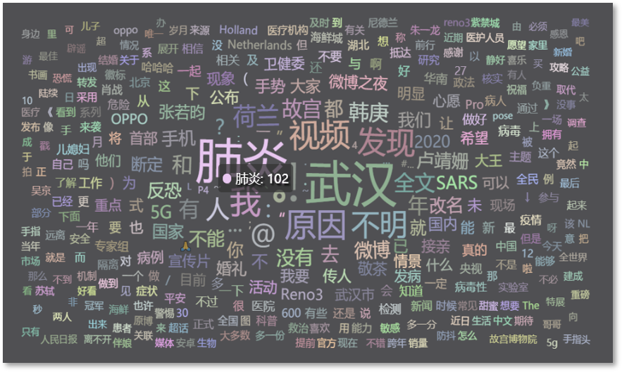
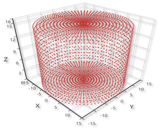
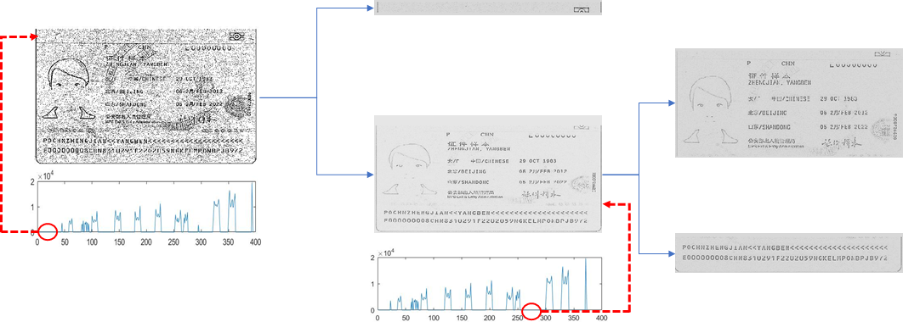

# Research&project

These are selected experiences of research and project, either memorizable or valuable to me.

## Content

[TOC]

## Major Ones

### The generation and detection of deepfakes, Dec. 2019 - May 2020

Code: https://github.com/Greenere/faceswap

This is my graduate design for my bachelor's degree. The major focus is the generation of deepfakes, more specificly, face swapped videos, for which I adjusted the existing method and made some minor improvements. The detection of deepfakes appears as a survey in the final paper.

While the core of the pipeline is to swap two faces with their identities,  the whole pipeline still takes a lot of work for auxiliary modules to construct an end-to-end pipeline. The skeleton of this pipeline is shown below.

Through the pipeline, the final deepfake video is generated by assembling the generated deepfake frames corresponding to each frame of the input video.

I configured public methods for the preprocessing and postprocessing, the major work was focused to the two modules of the core process. The intracoder here is a handy name I used for a pair of auto-encoders with switched decoders, and the color correction module shares the same structure with intracoder but a little difference in depth and size. A more detailed structure of the core process is shown below.

In the phase of training, each pair of identity auto-encoders will try to learn how to reconstruct the corresponding faces, and a different decoder will be taken in the phase of generation (as marked by solid arrows). The generated faces will share the identity with *Face1* and the gesture with *Face2*. Each pair of color auto-encoders will try to learn how to construct the corresponding faces from the reconstructed faces generated by identity auto-encoder in the phase of training. In the phase of generation, as marked by solid arrows, the faces with switched identity will be processed by the color auto-encoder trained on the faces of gesture donator (*Face1*) for the correction of colors and super-resolution.

More details can be found in the github repository.

### "WEIBE" weibo emotion analysis system, Nov. 2019 - Dec. 2019

Code: https://github.com/Greenere/weibe

This is a course project for the course, Capstone Project in Big Data Processing System. The core idea of this project is to fetch the trending topics of weibo (the Chinese version of Twitter) and analyze corresponding posts for the emotion tendencies concealed in each tweet.

I was responsible for the system rather than the algorithm behind the emotion analysis. The structure I designed for this system is as below.

The dark parts are the off-shelf programs utilized by this system and the light parts are our own modules. I wrote the Web Crawler in Python with the help of *Selenium* , driving a chrome browser to fetch the web pages of *Weibo*, collect trending topics and posts and put them into a *Mongodb* database. The Server is also composed with Python using *Flask* and *Gevent*. A very basic static pages server is capable enough for our purpose. The frontend is coded with the basic web languages, HTML for structure, CSS for style and JavaScript for actions. 

    
    

Due to the limited computational resources, we limited the number of posts fetched for each trending topic. It is not a really "big" data processing system, but the results were actually very informative. Unexpectedly, we happened to catch the trending topics invoked by an earthquake near Wuhan and the initial of COVID-19 outbreak. 

More details can be found in the github repository.

### Black-box adversarial attack, July 2019 - Sep. 2019

*Haoyang Li, Heng Li, Hansong Zhang, Wei Yuan, [Black-box attack against handwritten signature verification with region-restricted adversarial perturbations](http://www.sciencedirect.com/science/article/pii/S0031320320304921), Pattern Recognition, Volume 111, 2021,107689, ISSN 0031-3203*

In the course, Security of Network and Information, the professor introduced the problem of adversarial examples to us. I was intrigued by this abnormal phenomenon. I finished my course paper based on this topic, and a question occurred to me. I had tested a few adversarial attack methods on MNIST and the adversarial examples generated were not that imperceptible by all means. It seemed inevitable that noises would cover the majority of the background of images, making it easier to defend even by some simple background cleaning with threshold.

Besides, there is a clear difference in performance between white-box and black-box attack that the former is generally superior than the latter. It is rational since the former adopts much more information, but it is also obvious that the scenario of white-box attack is very ideal and in reality, it is basically impossible for an attacker to acquire the whole information of the target. 

With these questions and a feeling that I should try some research, I joined in the Data Science and Computer Vision Lab in National Anti-counterfeit Engineering Research Center in my university as a research intern, working with the same professor who taught the course. 

The MNIST dataset is simple and ideal. We would like to target something more realistic and we found signature, a very useful symbol in real life and shares similar features with digits, besides, another students were working on the verification of signatures, which made it more handy. The clear and separate foreground and background made the real samples resistant to background cleaning and the adversarial ones sensitive to it, which was proved by the experiments.  

To craft a "clean" adversarial example, our idea was direct, i.e. restricting the perturbations to the stroke region (i.e. the foreground). I  proposed an iterative framework to optimize the intensity and positions of perturbations separately and reached a satisfactory result. One of them is shown below on the left.

    
    

The generated adversarial examples were also proved to be resistant to the background cleaning. A comparison of the effects on the predicted probabilities by cleaning the background with different thresholds on adversarial examples generated with different methods is shown above on the right. It is very clear that the genuine signature is hardly effected as shown by the red dash dot line and our method sustains a good performance as shown by the blue solid line. 

This experience of research is really exciting to me. I walked through a whole process of research from literature review, algorithm design and implementation to paper writing.

### "WELLMAIL" e-mail client, Nov. 2018 - Dec. 2018

Code: https://github.com/Greenere/wellmail

This was the very first project I ever participated that could be referred as a project. For the course, Software Project, an e-mail client was required to be designed and  implemented. We were splitted into groups of three, and we had literally zero experience about how to begin. Most of the other groups chose Java to programmed it, while we chose Python after a few consideration. Python is light, new and all three members wanted to proceed into relevant areas that requires Python's help.

It took one week for us to familiarize with Python. I first divided the whole project into three parts: network module, management module and graphic user interface module. Each of us was then in charge of one of the modules. But later we discovered that most of our work would be related to graphic interface, which was quite different from those programs with consoles we coded before. 

Therefore, I redivided the project according to the lagical relationship of graphic user interfaces. The logical relationship is shown above. I was in charge of the Recieve Box module and the Main Module. A user firstly logged in through the Log Module, and then the Main Module communicated with the service, fetching the information. Then it was the Recieve Box Module that appeared in front of the user. Switches for the Writing Module, Setting Module, Contact Module, etc. could be made through the buttons on the left of the Main Module. A search bar was placed above, and the user could fetch the relevant e-mails with key words. 

We named this client as "WELLMAIL", in the "WELL" of which, "W" stands for Yun Wang, "L" and "L" stand for Xin Liu and Haoyang Li, and "E" stands for e-mail. This project was designated as one of the best among our peers, although it was clear to us that as a maiden work, there were many parts to be modified and improved. Anyway, the most important skill I got from this experience was the use of Python and the basic ability to develop a software with graphic user interface.

## Minor Ones

### 3-D displayer (with 2-D LED array), May 2019 - June 2019

This title is weird somehow. Well, it was a hardware project. We were required to craft a 3-D dsiplayer using a 2-D LED array, based on the persistence of vision. In plain text, we would rotate a plate planted with LEDs to create a hovering hologram of object that looked like a three dimensional one.  I was a part of a group of three, and majorly in responsible for the algorithm and software.

This problem seemed to be easy at first. We thought that if we could control the LEDs and motor simultaneously and synchronize them, we would be able to display any objects that were dismantled into arrays, prestored in the memory. But, there were nothing but troubles. First, we couldn't control the LEDs and motor synchronically, because they need to be powered separately and our resources were limited that we had no wireless communication module. Second, the memory was very small that it was impossible to store a series of arrays for an object. We had to generate it on the fly. Third, the 2-D LED array itself worked based on the persistence of vision, therefore the frequency of the rotation was limited in case that the 2-D array became separate dots.

Given those limitations, I devised a mechanism that moved most of the hard work to the software, where the memory was abundant, as shown above. To implement it, I developped a simulator with a structure of frontend and backend, with Python and JavaScript ( of course there was HTML).  The designed object and displayed object are shown below.

    <table width=300 border="0">
    <tr>
        <td align="center"></td>
    </tr>
    <tr>
        <td align="center"></td>
    </tr>
</table>

At the end, it was able to display cup, stair and cube, which was a three-dimensional element. Theoretically, with a more stable and more powerful device, it should be able to display anything. 

This was an interesting project. 

### Characters recognition for passport, Mar. 2019 - Apr. 2019

The course, Digital Image Processing, was organized with multiple projects. A final test and a final coursework will contribute to most of the grade. We, four other classmates and me, chose the characters recognition for passport as our final coursework. We thought that characters recognition would be a useful and interesting process. This process was presumed to be a part of the verification system in customs, therefore, it required to be both fast and accurate.

An example of passport, published by the authority to show the appearance of passport, was given to us, and we are required to program to recognize the characters in it. It is an image scanned by special equipment. We solved this problem with a two-phase algorithm. For the first phase, the characters were located and cut off  and then for the second, each separate image of characters was classified and recognized. 

The first phase was achieved with statistical method as shown above. We tested a bunch of methods and wfound out that a simple statistical one would be sufficient and satisfactory under such a limited dataset. The second phase was implemented with template match, but we did investigated a series of methods, including SVM and CNN-based classifiers. It was the limited dataset that made us admit that the template match was the relatively superior method.

To this point, this problem was basically solved. We compared the recognition result with Tesseract OCR (It was unfit to compare with those methods with training ), and it seemed our method was not inferior than it. But we had to agree that there were some intrinsic problems unsolved. 

In a word, we couldn't have the program distinguish "0" and "o" correctly, neither did most of the commercial ones. The "0" and "o" appear on the passport without clear patterns, making it even difficult for the contextual methods to work. I got familiar with multiple methods to process a image from this experience, and practiced the use of MATLAB from the beginning to the end.

## Extra Ones

### Louvre Evacuation Strategy (ICM 2019), Jan. 2019

In Janurary. 2019, I led a group of three competed in the Interdisciplinary Contest in Modeling (ICM). We chose the problem designated as "D" that required us to build a model for the Louvre Museum and design an evacuation  strategy for it.  It took us one day to discuss and decide an appropriate model and finally I proposed a cellular automata model for the Louvre. You may think that we represented each person to be evacuated as a cell, but actually we chose several representative exhibition halls to be the cells in our model.

This model of Louvre is presented above. For each cell, there was a state that represented the number of people stuck inside when the evacuation began. The neighbors were linked according to the structure of the building. For each iteration, the people in each cell would be evacuated to the neighbors following the strategy.  The baseline strategy we considered was "random wandering", which meant that no instructions were given and people just walked randomly. The evacuation process of the five levels of the Louvre is presented below on the left. Our solution was called "dynamic plan "

</img>
</img>

It is very clear that under our simulation, our strategy reduces the overall evacuation time from 3000s to 600s. This so called "dynamic plan" was very simple. The core idea of it was to make sure that no congestion occur during the whole process, i.e. people would be welcomed by relatively empty exhibition halls and rejected by nearly filled ones. Our simulation results showed that no matter what the original strategy was, all people would be evacuated quickly with a dynamic control of congestion.

This model was implemented by MATLAB. We drafted the paper in a rash, and I think an "Honorable Mention" is appropriate and satisfactory.

---

BACK TO <b><a href="../resume.html">RESUME</a></b> OR <b><a href="../index.html">HOME</a></b>