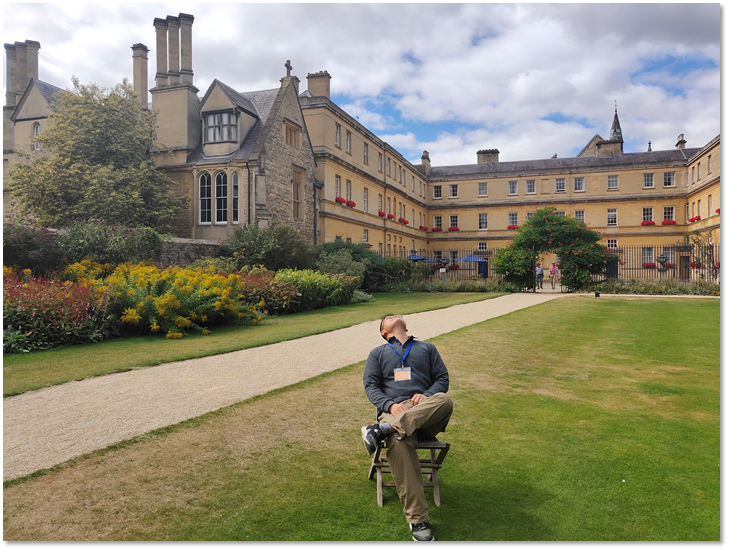

# Summer school in oxford

During the summer vacation of my second year in university, I signed up for a summer school in Oriel College, Oxford University. I chose two courses, Artificial Intelligence and Introduction to Knowledge Representation. 

The former one was majorly about the Symbolism.  Some may argue that the Symbolism is old-fashioned now and there is no need to know about it. But I thought it was meaningful to know about the earlier attempts to reach artificial intelligence. I got attrated by the logics and later chose the subsequent course, Introduction to Knowledge Representation.

In the latter course, I majorly learned parts of discrete mathematics. After I returned to China, I borrowed a book of discrete mathematicals from the library and learned it by myself. It was a pity that we had no chance to choose this course in this major. It gave me  some insights of the computer logically. 

These courses were refreshing to me, but there was more I got from this summer school. The idea to go abroad for a further study is dated back to this experience. I could feel that I wanted to try something exotic and new. In the future, if it is possible, I plan to travel around the world.

---

<b><a href="../resume.html">BACK TO RESUME</a></b>

