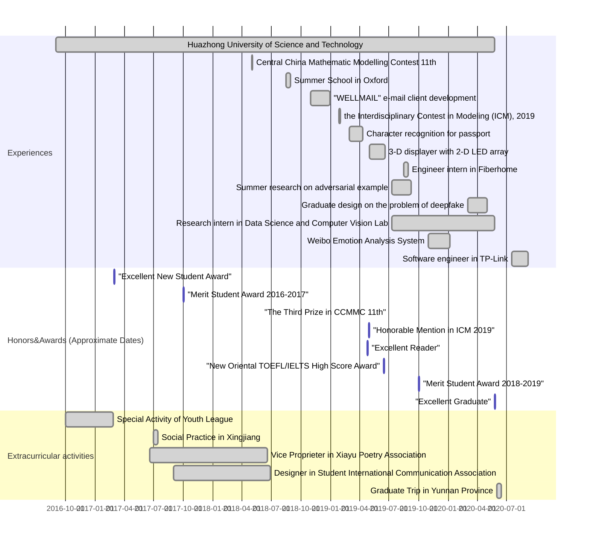

# TIMELINE

This is a timeline of mine from Fall 2016 on. 

All of these events are noted in the resume with some exceptions.

<table border="0">
    <tr>
        <td>Now...</td>
        <td>Going to be a research assistant in Prof. Xinggang Wang's lab...</td>
    </tr>
    <tr>
        <td>July. 2020  - Sep. 2020</td>
        <td>Worked as a software engineer in TP-Link on the development of IPC (Internet Protocol Camera). Exited in internship for personal reason.</td>
    </tr>
    <tr>
        <td>June.2020</td>
        <td>Graduated from Huazhong University of Science and Technology.</td>
    </tr>
    <tr>
        <td>Aug.2019</td>
        <td>Engineer intern in Wuhan Research Institute of Post and Technology (Fiberhome). It was majorly about optical network and its optimization.</td>
    </tr>
    <tr>
        <td>July.2019 - Sep.2019</td>
        <td>Carried out a summer research in Data Science and Computer Vision Lab, National Anti-counterfeit Engineering Research Center over adversarial example. We worked out a black-box adversarial attack against signature verification system. We drafted a paper, me as the first author, and it is under minor revision currently (Sep. 2020, <i>Pattern Recognition</i>). </td>
    </tr>
    <tr>
        <td>May.2019 - June.2019</td>
        <td>Led a group of three, designed and implemented a 3-D displayer with 2-D LED array as a hardware project. It was designated as one of the best among my peers.</td>
    </tr>
    <tr>
        <td>Apr.2019</td>
        <td>Won an "Honorable Mention" in the Interdisciplinary Contest in Modeling (ICM), 2019. The competition was held earlier in this year. 
Awarded as an "Excellent Reader" by the main library of Huazhong University of Science and Technology.</td>
    </tr>
    <tr>
        <td>Mar.2019 - Apr.2019</td>
        <td>Led a group of five, worked on a coursework for Digital Image Processing, characters recognition for passport.</td>
    </tr>
    <tr>
        <td>Nov.2018  - Dec.2018</td>
        <td>Led a group of three, designed and implemented an e-maile client named "WELLMAIL" as a software project. It was designated as one of the best among my peers.</td>
    </tr>
    <tr>
        <td >Aug.2018</td>
        <td>Enrolled in a Summer School about Artificial Intelligence in
Oriel College, Oxford University, Oxford, United Kingdom.</td>
    </tr>
    <tr>
        <td >May.2018</td>
        <td>Participated in the 11th Central China Mathematic Modelling Contest of University Students, and won a "Third Prize”.</td>
    </tr>
    <tr>
        <td >Oct.2017</td>
        <td>Awarded with “Merit Student Award”, Huazhong University of Science and Technology.</td>
    </tr>
    <tr>
        <td >July.2017 - June.2018</td>
        <td>Took charge of the exhibition “100 Years Development of China’s Modern Poems” in the major library as the vice proprietor in Xiayu Association of Poetry. Plus, I also participated in the organization of the second Show of Traditional Culture and published the first poetry anthology of our association with other members. </td>
    </tr>
    <tr>
        <td >July.2017</td>
        <td>Carried out an investigation on the construction of modern social culture in Xinjiang Uygur Autonomous Region with five teammates. It was awarded as an “Excellent Social Practice” in the university.</td>
    </tr>
    <tr>
        <td >Mar.2017</td>
        <td>Awarded with “Excellent New Student Award”, Huazhong University of Science and Technology.</td>
    </tr>
    <tr>
        <td >Sep.2016 - Feb.2017</td>
        <td>Organized an orienteering in the campus for the “Special Activity of Youth League” as the league branch secretary in class. It was awarded as one of the best 30 in the university. </td>
    </tr>
    <tr>
        <td >Sep.2016</td>
        <td>Enrolled into Huazhong University of Science and Technology.</td>
    </tr>
</table>
---

<b><a href="index.html">BACK TO THE HOMEPAGE</a></b>

